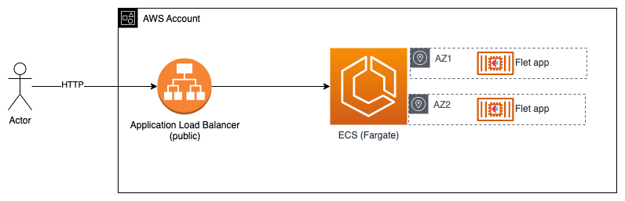

# ECS, ELB, Python 3.11, and a Flet app

Builds a Python 3.11, Flet app, deployed to AWS ECS.



## Build

    ./build.sh

You can also enter the container and start the app.

```zsh
docker exec -it cdk_ecs_python_3_11_flet sh
python main.py
```

To view the app, you can browse to `http://127.0.0.1` on your host computer (port 8080 works as well).

## With more time

1.  Configure a Route53 A-record alias pointed at the ALB
2.  Add allow for HTTPS to the ALB security group
3.  Create ACM certificate for custom domain.
4.  Change the ALB listener_port to 443, and use the certificate.
